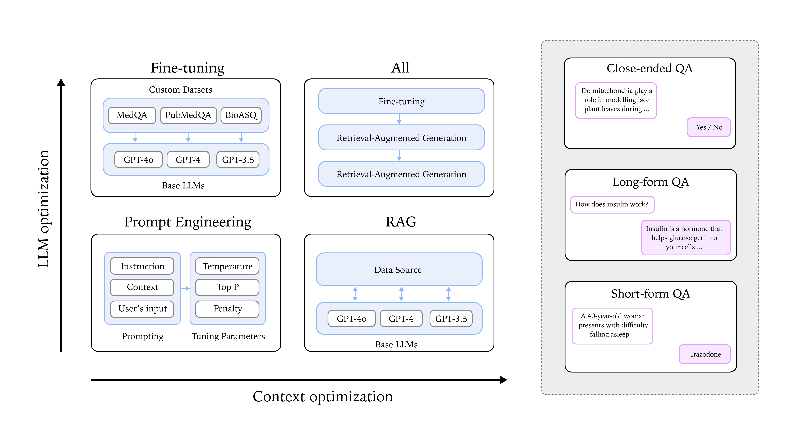
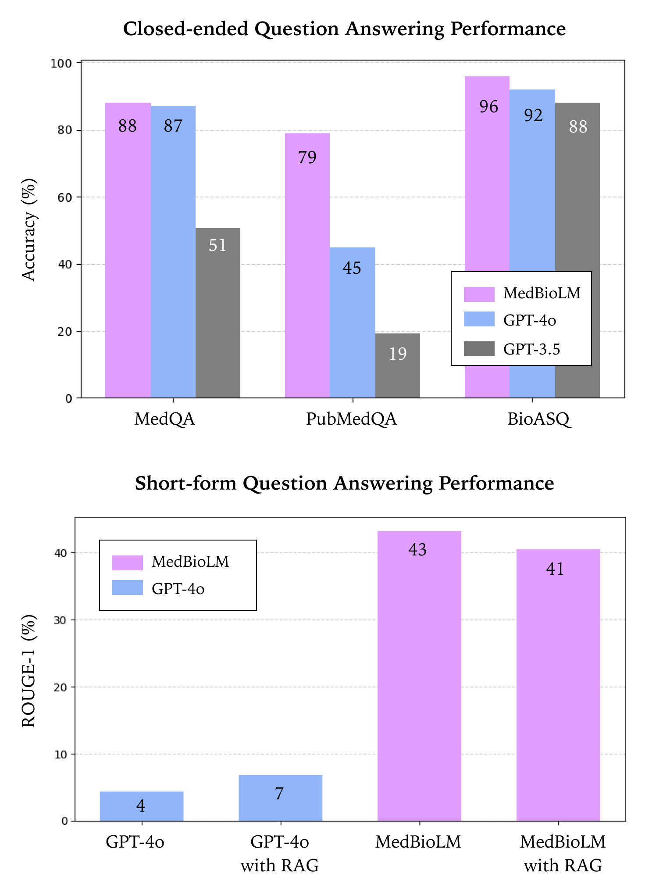

# MedBioLM: Optimizing Medical and Biological QA 
with Fine-Tuned Large Language Models and Retrieval-Augmented Generation

## Overview
**MedBioLM** is a domain-adapted biomedical question-answering model designed to enhance both short-form and long-form question answering. It integrates **fine-tuning** and **retrieval-augmented generation (RAG)** to dynamically incorporate domain-specific knowledge, improving reasoning abilities and accuracy. 

## Paper
For a detailed explanation of our approach, methods, and results, please refer to our paper:

🔗 [MedBioLM: Optimizing Medical and Biological QA with Fine-Tuned Large Language Models and Retrieval-Augmented Generation](https://drive.google.com/file/d/1v5M1Y3Po9oZtP5jvOvKZsueoT34GO7Oi/view?usp=sharing)

### Overview of MedBioLM

### Closed-ended and Short-form QA Performance

## Features
- Fine-tuned on **biomedical QA datasets** (PubMedQA, BioASQ, MedQA, and more)
- **Closed-ended QA**, **long-form QA**, and **short-form QA** optimization
- Incorporates **Retrieval-Augmented Generation (RAG)** for factual accuracy
- Evaluated on multiple metrics: **ROUGE, BLEU, BERTScore, and BLEURT**
- Outperforms general-purpose models like **GPT-4o and GPT-3.5** on domain-specific tasks

## Code Availability
🔧 **The code is currently being prepared and will be released soon!** Stay tuned for updates.

## Contact
For any questions or collaborations, feel free to contact:
📩 **Seonok Kim** (sokim0991@korea.ac.kr)

---
More updates will follow soon as we finalize the code repository!

